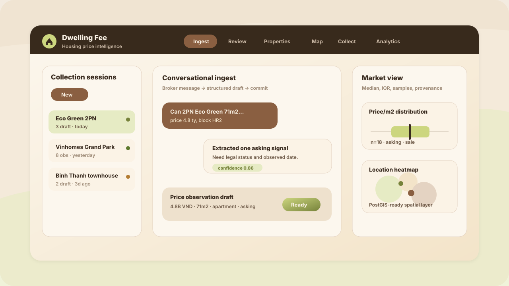
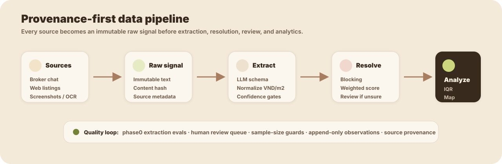

<p align="center">
  
</p>

<h1 align="center">Dwelling Fee</h1>

<p align="center">
  <strong>Housing price intelligence from messy broker messages, web listings, and collection agents.</strong>
</p>

<p align="center">
  <a href="docs/design.md">Product design</a>
  ·
  <a href="docs/collection-agent.md">Edge collection agent</a>
  ·
  <a href="phase0/README.md">Extraction evals</a>
</p>

<p align="center">
  
  
  
  
  
</p>



Dwelling Fee turns fragmented housing price signals into structured, queryable market intelligence for buying decisions. It is built around three hard problems: reliable extraction, careful entity resolution, and statistically honest analytics.

> Read [`docs/design.md`](docs/design.md) first when changing extraction, resolution, analytics, collection, or database behavior. The app is intentionally provenance-first and append-only.

## What It Does

- Collects broker messages, pasted listings, screenshots, and web crawl results as immutable `raw_signal` records.
- Extracts property observations with a structured LLM schema and keeps incomplete data in a conversational draft.
- Resolves extracted observations to existing property entities using deterministic blocking and scoring.
- Sends ambiguous or low-confidence matches to a human review queue instead of silently merging data.
- Computes segmented price distributions using median/IQR and sample-size guards.
- Preserves source provenance from every committed observation back to raw text and ingest session.

## Product Surfaces

| Surface | Purpose |
|---|---|
| Ingest | Chat-first collection session for broker text, listing snippets, and screenshots. |
| Review | Human-in-the-loop queue for ambiguous entity links and low-confidence observations. |
| Properties | Living pages for projects/properties with observation history and price distributions. |
| Analytics | Segmented market stats that keep asking/transacted and sale/rent separate. |
| Map | Spatial view for location intelligence and future heatmaps. |
| Collect | Source registry, edge device management, crawl queue, and collection events. |

## Data Pipeline



The core artifact is `raw_signal`: unstructured source text plus metadata. Broker chat, crawler output, screenshots, and future outreach replies all enter through this same provenance-preserving path.

## Architecture

```txt
app/               Next.js App Router UI and API routes
db/                Drizzle schema, Neon client, PostGIS/pgvector extensions
lib/ai/            Vercel AI SDK provider/model registry
lib/extraction/    LLM prompt, Zod schema, completeness checks
lib/ingest/        Session chat, draft persistence, one-shot ingest path
lib/collection/    Source registry and shared edge extraction helpers
lib/resolution.ts  Deterministic entity blocking, scoring, and decision bands
lib/review.ts      Human review queue services
lib/analytics.ts   Market stats and sample-size guarded distributions
phase0/            Extraction evaluation harness and golden fixtures
docs/              Product design and implementation notes
```

## Stack

- **App:** Next.js 15 App Router, React 19, TypeScript
- **Database:** Neon Postgres, Drizzle ORM, PostGIS, pgvector
- **Auth:** Auth.js / NextAuth v5 with Google allowlist
- **AI:** Vercel AI SDK with OpenAI, Anthropic, and Gemini provider support
- **Testing:** Node test runner, Playwright
- **Deployment:** Vercel for the app; external workers for long-running browser/Zalo automation

## Local Setup

```bash
npm install
cp .env.example .env
```

Fill the required values in `.env`:

```bash
DATABASE_URL=
AUTH_SECRET=
AUTH_GOOGLE_ID=
AUTH_GOOGLE_SECRET=
AUTH_ALLOWED_EMAILS=
OPENAI_API_KEY=          # or another configured provider key
```

Initialize the database:

```bash
psql "$DATABASE_URL" -f db/extensions.sql
npm run db:push
```

Run the app:

```bash
npm run dev
```

Open `http://localhost:3000`, sign in with an allowlisted Google account, and start an ingest session.

## Commands

| Command | Purpose |
|---|---|
| `npm run dev` | Start the local Next.js dev server. |
| `npm run build` | Build the production app. |
| `npm run start` | Serve the production build. |
| `npm run typecheck` | Run TypeScript checks. |
| `npm run test:unit` | Run deterministic unit tests. |
| `npm run test:e2e` | Run Playwright E2E tests. |
| `npm run phase0:eval` | Evaluate extraction accuracy against golden data. |
| `npm run phase0:extract -- "<message>"` | Run the extractor against one broker message. |
| `npm run db:push` | Sync the Drizzle schema to the database. |
| `npm run db:generate` | Generate versioned migrations. |
| `npm run db:migrate` | Apply versioned migrations. |

## Quality Rules

- Preserve provenance: raw text stays immutable and observations link back to source signals.
- Preserve append-only facts: corrections happen through review, links, merges, or new observations.
- Store money as integer VND; avoid floats for currency.
- Never mix asking/transacted or sale/rent in default analytics.
- Use median/IQR and show low sample sizes clearly.
- Send uncertain extraction or entity resolution to human review.
- Keep crawler and outreach behavior compliant: no login bypass, CAPTCHA bypass, or anti-bot circumvention.

## Roadmap

| Phase | Status | Focus |
|---|---:|---|
| Phase 0 | Done | Extraction harness and golden-set evaluation. |
| Phase 1 | Done | Conversational ingest, entity resolution, review, properties, analytics. |
| Phase 2 | Next | Geocoding, map/heatmap quality, OCR for screenshots. |
| Phase 3 | In progress | Collection agent, source quality gates, durable crawler runs. |
| Phase 4 | Planned | Buyer-side broker outreach with human approval, Zalo bridge worker. |

## Collection Agent Notes

The app has a Vercel-friendly HTTP crawler path for allowed public sources. Browser automation and Zalo personal-account automation should run as separate workers, not inside Vercel route handlers. See [`docs/collection-agent.md`](docs/collection-agent.md) for the current implementation plan and safety constraints.

## License

Private project. Do not redistribute without permission.
